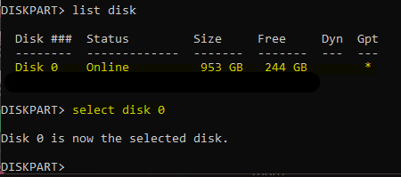
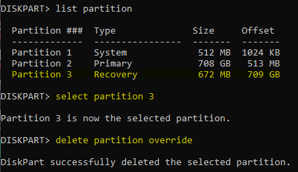
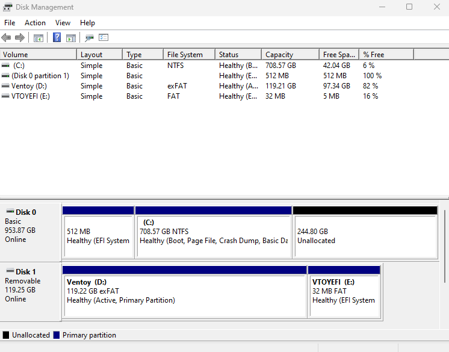
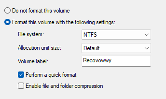

*Fixing my drive by moving my recovery partition... WITH FORCE!*

### Disk Management Blunders

I own a super sexy Windows 11 system with a 1TB NVME SSD, which in the short-sighted scramble to dual-boot (and subsequently demolish) Manjaro: it became partitioned, split into two... Of course, as Windows tends to do, I was thrown a curve-ball which made re-uniting these two halves impossible:

This, dear reader, is the tragic scene I was met with. Before you is a screenshot from my faithful Disk Management tool, and depicted is a recovery partition between NTFS and unallocated partitions... Romeo and Juliet style. Heartbreaking :-{

### Alas!

There is, *thank the lord above*, a solution to my small abuse of this poor innocent 1TB NVME Samsung SSD...

> Note: This does require an administrative prompt... but you knew that already you smart cookie ;-3

1. In order to expand my NTFS partition, we have to delete the Recovery partition. This is made fairly simple by the `reagentc` utility in Windows.

    

    We use `reagentc /disable` to disable the Windows recovery environment, which moves the partition to a file called "Winre.wim" in C:\Windows\System32\Recovery. 

2. Using `diskpart`, we'll now force delete the recovery partition.

    

    We'll list our disks and select the one we want to modify. In this case, that's my super cool 1TB NVME Samsung SSD ^w^

    Next, let's select and delete the partition:

    

    We'll list the partitions using `list partition`, then select the Recovery one (in my case thats Partition 3) using `select partition 3` and finally force delete it using `delete partition override`! 

3. Profit(???)

    

    Hooray! As you can see the two long seperated partitions are reunited in harmony ~<3

    But now, unfortunately, we should probably add back our recovery partition so our system can be safer </3

4. Extend the NTFS partition so there is about 1024 MB left of unallocated space, so we can re-add the recovery partition:

    

5. Now we want to create a New Simple Volume with the unallocated space.

    Firstly we don't want to assign this drive a letter:

    

    You can name it whatever you want, I named mine "Recovowwy" xP

    

    Perform the quick format!

6. **Lets finish things >:3** Back in diskpart:

    1. `list partition`
    2. Select your recovery partition
    3. The partition IDs for recovery is "de94bba4-06d1-4d40-a16a-bfd50179d6ac", which you can add using:
        > `set id=de94bba4-06d1-4d40-a16a-bfd50179d6ac`
    3. Add the gpt flag so Windows recognizes the partition:
        > `gpt attributes=0x8000000000000001`

7. Re-enable `reagentc /enable`'

### Reunited at last!

Now our two seperate partitions may become one, and I may rest my head knowing the many 100GB+ games will no longer choke me out of my machine.

<3